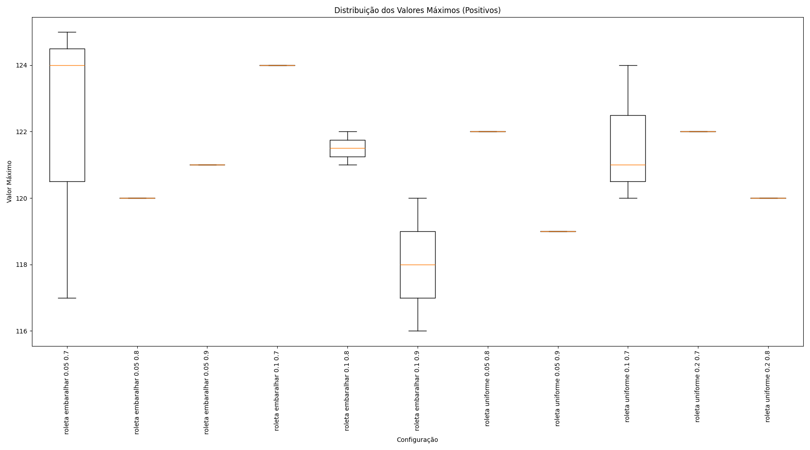
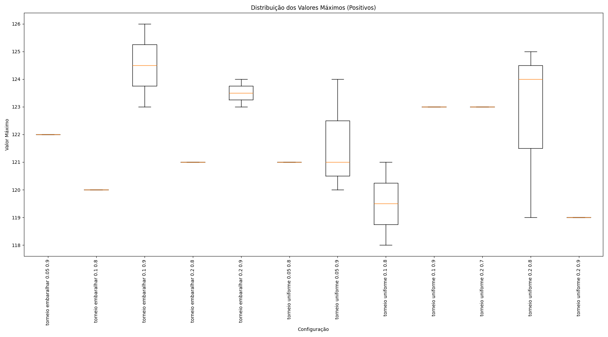
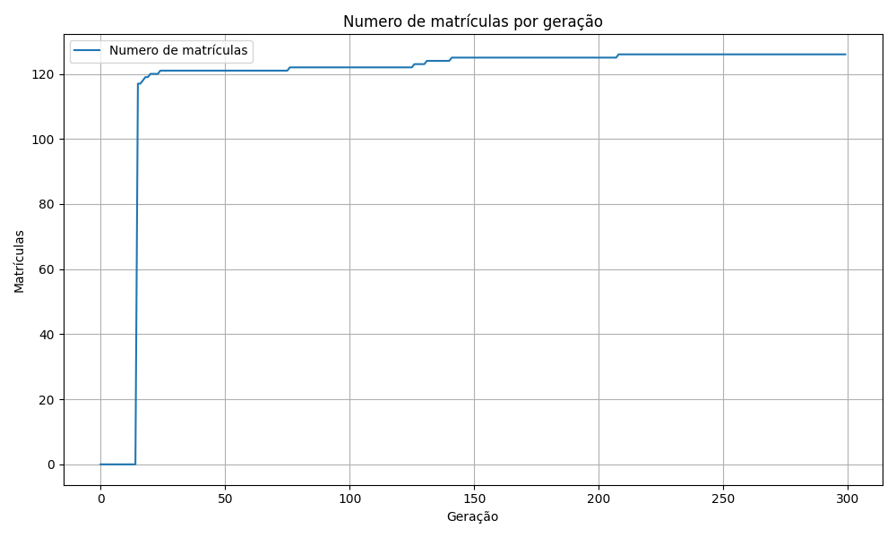

Este repositório contém o código-fonte, dados e resultados desenvolvidos para o Trabalho de Conclusão de Curso (TCC) focado na otimização de grades horárias. O projeto utiliza uma abordagem baseada em Algoritmos Genéticos para resolver conflitos e aumentar a eficiência na alocação de disciplinas.

Estrutura do Repositório
Abaixo está a descrição dos principais arquivos e diretórios deste projeto:

Execução e Código Fonte
main.py: O arquivo principal. É responsável por orquestrar a execução da heurística. Ele chama as funções de carregamento, executa o algoritmo genético e salva os resultados.

schedule_data_loader.py: Responsável por ler os dados brutos dos arquivos CSV na pasta data/, processá-los e formatá-los para serem consumidos pelo algoritmo genético.

generate_grade.py: Script utilitário pós-processamento. Dada uma solução encontrada pelo algoritmo, ele gera uma a grade horária em formato CSV.

Configuração
config.yaml: Arquivo de configuração central. Nele é possível alterar os parâmetros da heurística alem dos caminhos para os dados para o algoritmo genetico 

Dados e Resultados
data/: Contém os arquivos .csv de entrada necessários para o funcionamento do algoritmo

results/: Diretório onde são salvos os outputs do trabalho, incluindo:

Logs das execuções.

Gráficos e grade horaria.

Dados do formulario. 

Resultados: 




Como Executar
Este projeto utiliza o uv para gerenciamento de dependências e ambientes virtuais, garantindo uma execução rápida e reprodutível.

Pré-requisitos
Python 3.x

uv instalado (Caso não tenha, instale com pip install uv ou consulte a documentação oficial).

Passo a Passo
Clone o repositório:

Bash

git clone https://github.com/seu-usuario/nome-do-repo.git
cd nome-do-repo
Sincronize o ambiente: Este comando criará o ambiente virtual e instalará todas as dependências necessárias automaticamente.

```console

uv sync```
Configure os parâmetros (Opcional): Edite o arquivo config.yaml caso queira alterar os parâmetros da heurística (população, gerações, etc.).

Execute a heurística: Utilize o uv run para rodar o script principal dentro do ambiente isolado:

```console

uv run main.py```

Gerar grade visual: Para exportar a grade de uma solução específica:

```console

uv run generate_grade.py```

Resultados Obtidos
    Os gráficos e resultados gerados durante os experimentos encontram-se na pasta results/. O algoritmo demonstrou eficácia na alocação da grade horaria

